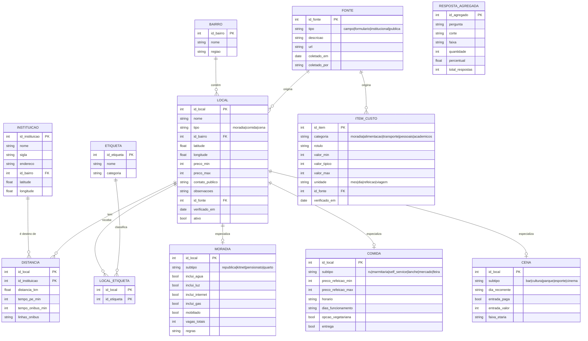

# 04. Modelo de dados

Duas representações do mesmo domínio:

1. **Modelo ER relacional**, que é o entregável da disciplina de Modelagem de Banco de Dados e a base do 2º semestre.
2. **JSON estático**, que é o que o site realmente consome neste semestre, já que não há back-end.

A regra que amarra as duas: **o JSON é uma projeção do ER, não um formato paralelo.** Cada arquivo JSON corresponde a uma tabela ou a uma visão de junção do modelo. Quando o banco entrar, no 2º semestre, a migração é uma carga de dados, não uma remodelagem.

## 4.1 Entidades

| Entidade | O que representa | Origem do dado |
| --- | --- | --- |
| `instituicao` | Campus de ensino superior da cidade | Fonte institucional |
| `bairro` | Bairro de Marília usado como referência geográfica | Fonte pública |
| `local` | Superentidade de qualquer ponto do guia | Campo e formulário |
| `moradia` | Especialização de `local` para república, kitnet, pensionato, quarto | Campo |
| `comida` | Especialização de `local` para lugar de comer ou comprar comida | Campo |
| `cena` | Especialização de `local` para bar, cultura, parque, esporte | Campo |
| `etiqueta` | Rótulo reutilizável, por exemplo "contas inclusas", "vegetariano", "aberto à noite" | Curadoria |
| `local_etiqueta` | Associação N para N entre `local` e `etiqueta` | Curadoria |
| `distancia` | Distância e tempo entre um `local` e uma `instituicao` | Cálculo e campo |
| `fonte` | Procedência de um dado, com data e tipo | Processo de coleta |
| `item_custo` | Linha de referência da calculadora, por exemplo "aluguel em república" | Formulário e campo |
| `resposta_agregada` | Resultado tabulado do formulário, sem identificação | Formulário |

### Por que uma superentidade `local`

Moradia, comida e cena compartilham 80% dos campos (nome, bairro, faixa de preço, coordenadas, verificação, etiquetas) e o site precisa buscar, ordenar e comparar de forma uniforme. Herança com tabela pai `local` e tabelas filhas por tipo evita repetir a mesma coluna em três lugares, mantém a busca única e é exatamente o exercício de especialização e generalização que a disciplina cobra.

## 4.2 Diagrama ER



## 4.3 Dicionário de dados, campos que exigem explicação

| Campo | Regra |
| --- | --- |
| `preco_min` e `preco_max` | Inteiros em reais, sem centavos. Quando o preço é único, os dois campos recebem o mesmo valor. Nunca `null`: preço desconhecido significa que o registro não está pronto para publicar |
| `verificado_em` | Data ISO `AAAA-MM-DD`. É o campo que o site exibe e o script de validação cobra |
| `ativo` | `false` esconde o registro sem apagar o histórico. Preferir desativar a deletar |
| `contato_publico` | Só telefone comercial ou perfil público de estabelecimento. **Nunca** contato pessoal de morador ou proprietário |
| `tempo_pe_min` | Estimativa por distância em linha reta multiplicada por 1,3 (fator de malha urbana), a 5 km/h. A fórmula está publicada na página de metodologia |
| `regras` | Texto livre curto sobre convivência, por exemplo "não aceita pet, visita até 22 h". Copiado do que a casa declara, sem juízo de valor |
| `id_fonte` | Obrigatório. Registro sem fonte não entra no arquivo publicado |

### Normalização
O modelo está na 3ª Forma Normal:
- **1FN:** nenhum campo multivalorado. Etiquetas saíram para tabela associativa em vez de uma coluna com valores separados por vírgula.
- **2FN:** todo atributo depende da chave inteira. `distancia` tem chave composta (`id_local`, `id_instituicao`) e seus atributos dependem das duas.
- **3FN:** nada de dependência transitiva. O nome do bairro vive em `bairro`, não repetido em `local`.

Desvio consciente: `preco_min` e `preco_max` ficam em `local` mesmo variando de semântica entre os tipos (aluguel mensal, refeição, entrada). O campo `unidade` implícita fica no tipo. A alternativa normalizada pura (tabela de preços polimórfica) complicaria a consulta sem ganho neste tamanho de base. **Registrar esse desvio na apresentação é melhor do que esperar que o professor não perceba.**

## 4.4 Projeção em JSON

Estrutura de arquivos em `/dados`:

```
dados/
  meta.json           versão da base, data de geração, contagens
  instituicoes.json
  bairros.json
  etiquetas.json
  moradia.json        local + moradia + etiquetas + distâncias, já unidos
  comida.json
  cena.json
  custos.json         item_custo, usado pela calculadora
  agregados.json      resposta_agregada, usado na página de metodologia
```

**Por que já unido (desnormalizado) no JSON:** sem banco não há JOIN, e fazer o navegador cruzar quatro arquivos a cada filtro é lento e cheio de bug. O JSON publicado é a "view" pronta para leitura. A forma normalizada continua existindo no ER e na planilha de origem.

### Exemplo, `moradia.json`

```json
{
  "versao": "2026-11-01",
  "itens": [
    {
      "id": "mor-012",
      "nome": "República Casa Amarela",
      "tipo": "moradia",
      "subtipo": "republica",
      "bairro": "Palmital",
      "coordenadas": { "lat": -22.2210, "lon": -49.9460 },
      "preco_min": 550,
      "preco_max": 650,
      "unidade": "mes",
      "inclui": ["agua", "luz", "internet"],
      "mobiliado": true,
      "vagas_totais": 6,
      "regras": "Sem pet. Faxina em escala semanal.",
      "etiquetas": ["contas-inclusas", "mobiliado", "ate-15min-a-pe"],
      "distancias": [
        { "instituicao": "fatec", "km": 1.2, "pe_min": 18, "onibus_min": 9 },
        { "instituicao": "unesp", "km": 3.4, "pe_min": 51, "onibus_min": 21 }
      ],
      "contato_publico": null,
      "observacoes": "Vagas costumam abrir em dezembro e junho.",
      "fonte": { "tipo": "campo", "coletado_por": "equipe", "url": null },
      "verificado_em": "2026-10-14",
      "ativo": true
    }
  ]
}
```

### Exemplo, `custos.json`

```json
{
  "versao": "2026-11-01",
  "itens": [
    {
      "id": "cst-moradia-republica",
      "categoria": "moradia",
      "rotulo": "Vaga em república, com contas",
      "valor_min": 450,
      "valor_tipico": 650,
      "valor_max": 900,
      "unidade": "mes",
      "fonte": { "tipo": "formulario", "url": null },
      "verificado_em": "2026-10-20"
    },
    {
      "id": "cst-transporte-onibus-estudante",
      "categoria": "transporte",
      "rotulo": "Passagem de ônibus, tarifa estudante",
      "valor_min": 287,
      "valor_tipico": 287,
      "valor_max": 287,
      "unidade": "viagem_centavos",
      "fonte": { "tipo": "publica", "url": "https://mobile.amtumarilia.com.br/tarifas.php" },
      "verificado_em": "2026-09-09"
    }
  ]
}
```

> **Cuidado com unidade:** tarifa em centavos evita erro de ponto flutuante em soma. Padrão do projeto: **todo valor monetário é inteiro**, em reais para valores mensais e em centavos onde o centavo importa, sempre declarado em `unidade`. Formatação para exibição fica na camada de apresentação, com `Intl.NumberFormat('pt-BR', { style: 'currency', currency: 'BRL' })`.

### Convenções de identificador
- `id` textual e estável: `mor-012`, `com-034`, `cen-007`, `cst-transporte-onibus-estudante`.
- Identificador nunca é reaproveitado, mesmo após desativação. Ele aparece na URL do comparador, e URL compartilhada que muda de significado é pior do que URL quebrada.

## 4.5 Validação

Checagens mínimas antes de publicar, roda a cada alteração de dados:

1. JSON válido em todos os arquivos.
2. Todo item tem `id` único, `nome`, `bairro`, `preco_min`, `preco_max`, `fonte` e `verificado_em`.
3. `preco_min` menor ou igual a `preco_max`.
4. `verificado_em` não está no futuro e tem menos de 60 dias.
5. Toda etiqueta usada existe em `etiquetas.json`.
6. Toda instituição citada em `distancias` existe em `instituicoes.json`.
7. Todo bairro citado existe em `bairros.json`.
8. Nenhum campo de contato contém padrão de telefone pessoal em registro de moradia.

Implementação sugerida: um `validar.mjs` executado com Node no ambiente de desenvolvimento, resultado impresso no terminal. Ele não vai para a produção, é ferramenta de trabalho. Se o grupo preferir não usar Node, a mesma checagem cabe em uma página `validar.html` local, o que tem a vantagem de rodar em qualquer máquina do time sem instalação.

## 4.6 Fórmula da calculadora

```
custo_mensal(perfil) =
    moradia(perfil.tipo_moradia)
  + alimentacao(perfil.refeicoes_fora_semana, perfil.mercado)
  + transporte(perfil.modo, perfil.viagens_por_semana)
  + pessoais(perfil.nivel)
  + academicos(perfil.nivel)
```

Detalhamento:

| Parcela | Cálculo |
| --- | --- |
| `moradia` | Valor direto do `item_custo` correspondente ao tipo escolhido. Zero para quem mora com a família |
| `alimentacao` | `(refeicoes_fora_semana × preco_refeicao × 4,33) + mercado_mensal`. O 4,33 é a média de semanas por mês (52/12) e precisa aparecer na metodologia |
| `transporte` | `viagens_por_semana × tarifa × 4,33`, com tarifa cheia ou de estudante. Zero para quem vai a pé ou de bicicleta |
| `pessoais` | Faixa fixa por nível declarado (baixo, médio, alto), calibrada pelo bloco E do formulário |
| `academicos` | Material, impressão e cópias. Faixa fixa pequena, calibrada por estimativa e declarada como estimativa |

Cada parcela retorna `{ min, tipico, max }`, e o total é a soma componente a componente. **Não somar as parcelas típicas e chamar o resultado de exato.** A saída na tela é sempre uma faixa, com uma linha de texto explicando que a estimativa vem de N respostas coletadas em determinada data.
